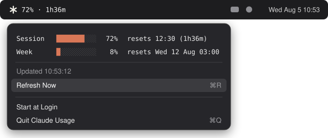

<p align="center">
  
</p>

<h1 align="center">Claude Usage — macOS menu bar widget</h1>

A tiny native menu bar app that shows your current Claude Code **session usage %**
and a **countdown until the session resets**, e.g. `✳ 72% · 1h36m`.
Click the icon for the full breakdown:

<p align="center">
  
</p>

The text turns **orange at ≥80%** and **red at ≥95%** usage.

## Install

Download `ClaudeUsage.zip` from the
[latest release](https://github.com/ivaruf/claude_usage_menulet/releases/latest),
unzip it, and move `ClaudeUsage.app` wherever you like (e.g. `/Applications`).

The app is ad-hoc signed, not notarized by Apple, so macOS quarantines the
download and will refuse to open it. Clear the quarantine flag once:

```bash
xattr -d com.apple.quarantine ClaudeUsage.app
open ClaudeUsage.app
```

Releases are built from source by
[GitHub Actions](.github/workflows/release.yml) — or build it yourself below,
it takes seconds.

## How it works

- Reads your Claude Code OAuth token from the macOS Keychain
  (item `Claude Code-credentials`, falling back to `~/.claude/.credentials.json`).
- Polls `https://api.anthropic.com/api/oauth/usage` every 60 seconds — the same
  endpoint Claude Code's own `/usage` command uses.
- The countdown in the menu bar ticks every 10 seconds between polls.
- No dock icon (`LSUIElement`), no dependencies — one Swift file compiled with `swiftc`.

## Build & run

```bash
./build.sh
open ClaudeUsage.app
```

Requires Xcode Command Line Tools (`xcode-select --install`).

## Cutting a release

Push a version tag — CI builds the app, zips it, and attaches it to a GitHub
release:

```bash
git tag v1.1 && git push origin v1.1
```

## Start at login

Click the menu bar icon → **Start at Login**. (Uses `SMAppService`; if you move
the .app afterwards, toggle it off and on again.)

## Troubleshooting

- **Keychain popup on first launch** — macOS asking to allow reading the
  `Claude Code-credentials` item. Click **Always Allow**.
- **Shows `—` / "Token expired"** — the OAuth token in the Keychain has expired.
  Run any Claude Code command; it refreshes the token, then hit **Refresh Now**.
- **Shows `…`** — still loading, or no network.
- **"Rate-limited — will retry in a few minutes"** — the usage endpoint throttles
  bursts of requests. The widget backs off for 3 minutes automatically. Make sure
  you don't have more than one copy of the widget running (`pgrep -fl ClaudeUsage`).
